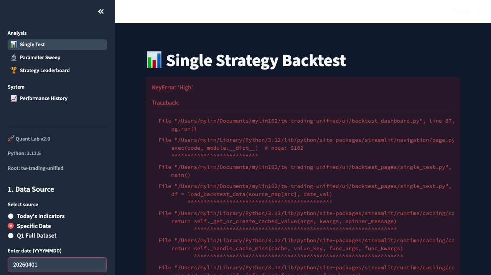
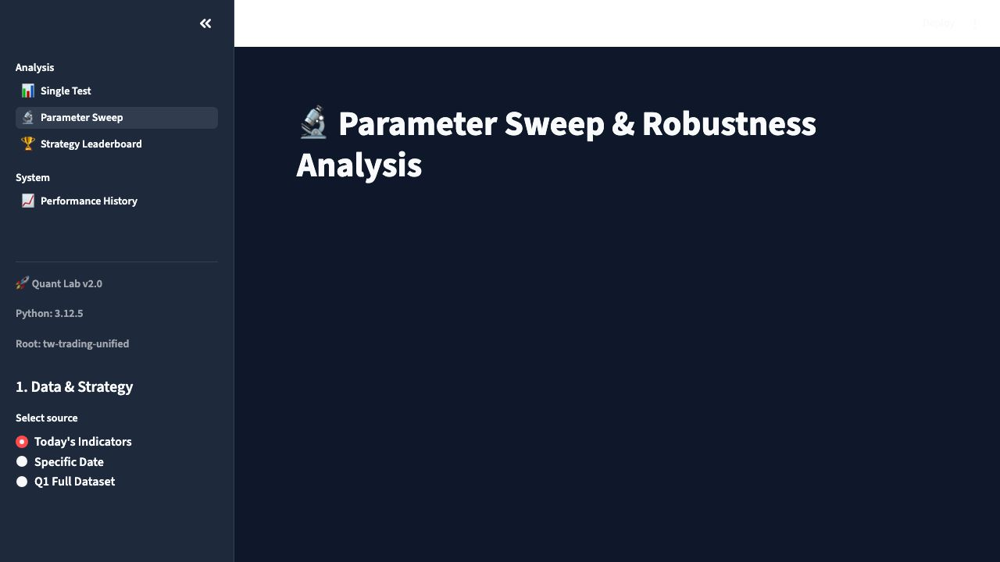
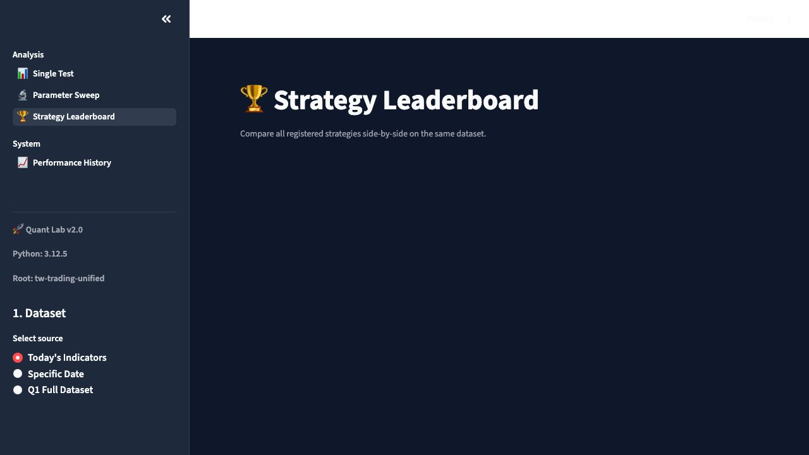
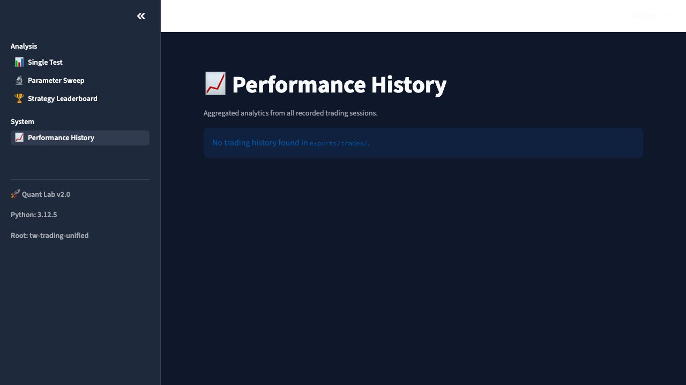

# 🔬 Quant Lab v2.0: Institutional-Grade Backtest Handbook

歡迎來到 **Quant Lab v2.0**。這是一套專為台灣期貨 (TMF) 設計的專業級策略研發與驗證系統。

---

## 🚀 快速啟動 (Quick Start)

系統預設運行於 `Port 8501`。
若服務未啟動，請執行：
```bash
streamlit run ui/backtest_dashboard.py --server.port 8501
```

---

## 1. 📊 單一策略回測 (Single Test)
這是最基礎的研究模組，用於深度解剖特定日期的策略表現。



### 核心功能：
*   **資料自癒 (Data Self-Healing):** 自動辨識大小寫、處理重複欄位，並補齊遺失的指標（如 `ema_filter`, `adx`）。
*   **回撤解剖刀 (Drawdown Autopsy):** 
    *   圖表上的 **紅色陰影** 自動標示權益曲線的回落時段。
    *   **互動過濾:** 直接在圖表上框選時間段，下方的「交易明細」會自動同步過濾。
*   **動態止損 (Adaptive Stop):** 觀察 `psar_breakout` 在高波動期（ATR > 40）自動收緊止損的效果。

---

## 2. 🔬 參數掃描 (Parameter Sweep)
用於尋找穩健的「獲利高原」，而非脆弱的「效能孤峰」。



### 核心功能：
*   **效能熱力圖 (Heatmap):** 同時掃描兩組參數（如 Entry Score vs ATR Mult），一眼找出獲利穩定的區域。
*   **真實蒙地卡羅 (Real-Trade Monte Carlo):** 
    *   系統會抓取回測產生的 **真實交易清單**。
    *   隨機打亂順序 1,000 次，計算出 **95% 信心水準下的極限風險**。
    *   這能告訴您：即使策略會賺錢，如果遇到連續虧損（序列風險），您的本金是否足夠。

---

## 3. 🏆 策略排行榜 (Strategy Leaderboard)
一鍵比較所有註冊策略，快速篩選出當前市場的「阿爾法」。



### 核心功能：
*   **平行對比:** 在同一個資料集（如 Q1 Full Dataset）上跑完所有 10 種策略。
*   **多維指標:** 自動計算 PnL、勝率、Profit Factor (PF) 與最大回撤。
*   **Q1 最佳策略:** 目前實證在戰爭高波動期，`psar_breakout` 是唯一穩定獲利的贏家。

---

## 4. 📈 績效歷史 (Performance History)
追蹤您所有實戰與模擬交易的長期表現。



### 核心功能：
*   **Lifetime Stats:** 彙整 `exports/trades/` 的全量 CSV 數據。
*   **全歷史權益曲線:** 觀察策略在不同月份、不同地緣政治環境下的適應性。

---

## ⚙️ 實戰部署 (Sync & Rollback)

在 **Single Test** 頁面找到最佳參數後：
1.  點擊 **"Apply Parameters to PAPER/LIVE"**。
2.  系統會自動備份 `config/futures.yaml` 並寫入新參數。
3.  若表現不如預期，點擊 **"Rollback Last Change"** 即可瞬間恢復。

---

## 🛡️ 技術保障：V-Model 流程
本系統遵循嚴格的 **V-Model 驗證規範**：
*   **Level 1:** `test_vmodel_compliance.py` 確保新策略 100% 兼容。
*   **Level 2:** `test_real_integration.py` 確保實戰資料載入不崩潰。
*   **Level 3:** `gstack-health` 全域健康檢查，維持代碼清潔度。

---
*Generated by Gemini CLI - 2026-04-04*
