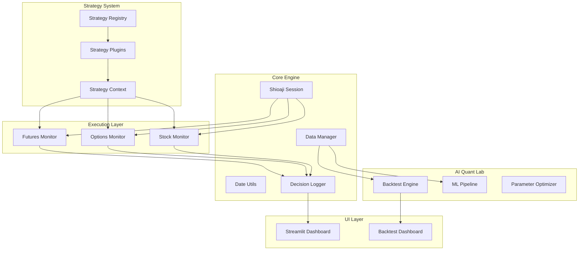

<!-- generated-by: gsd-doc-writer -->
# Technical Architecture | 技術架構

This document describes the internal architecture of the Taiwan Trading Unified system, a high-performance framework for multi-asset trading (Futures, Options, and Stocks) in the Taiwan market.

## System Overview | 系統總覽

Taiwan Trading Unified is a modular trading system designed for deterministic execution, rigorous backtesting, and AI-driven signal optimization. It follows a pluggable architecture where market monitors handle data ingestion and state management, while strategy plugins define the entry/exit logic. The system prioritizes capital protection and financial integrity, incorporating broker fees, taxes, and margin requirements into all PnL calculations.

---

## 1. Core Engine | 核心引擎

The Core Engine provides the foundational services used by all asset monitors and strategies.

*   **Data Manager (`core/data_manager.py`)**: Centralized access to the historical Parquet database. It provides high-performance loading of 5-minute bars and manages data inventory statistics.
*   **Session Handling (`core/shioaji_session.py`)**: Manages a singleton `shioaji.Shioaji` instance shared across the process. It handles secure login (using `.env`), CA activation, and automatic retry logic for connection limits.
*   **Date Utils (`core/date_utils.py`)**: Provides vectorized trading day mapping, session boundary detection (Day/Night sessions), and holiday handling to ensure temporal consistency across data streams.
*   **Session Config (`core/session_config.py`)**: Manages runtime configuration for different trading sessions, including contract selection and risk parameters.

---

## 2. Asset Monitors | 資產監控器

Asset monitors are the primary orchestration layers for specific market instruments.

*   **Futures Monitor (`strategies/futures/`)**: Tracks TX/MTX futures. It manages real-time tick-to-kbar conversion, technical indicators (VWAP, RSI, Bollinger Bands), and order execution via `shioaji`.
*   **Options Monitor (`strategies/options/`)**: Specialized for Weekly/Monthly options. Includes `live_options_squeeze_monitor.py` for volatility-based trading and `theta_gang.py` for premium harvesting.
*   **Stock Monitor (`strategies/stocks/`)**: 
    *   **Screener/Scanner**: Real-time and daily scanning for patterns.
    *   **Squeeze Logic**: Detects volatility compression and expansion (TTM Squeeze) optimized for Taiwan stocks.
    *   **CANSLIM Logic**: Technical implementation of the CANSLIM methodology, focusing on technical breakouts and volume confirmation (`pattern_engine.py`, `entry_strategies.py`).

---

## 3. Strategy System | 策略系統

The system uses a pluggable "V-Model" strategy architecture to separate signal logic from execution infrastructure.

*   **Strategy Registry (`core/strategy_registry.py`)**: Automatically discovers and loads strategy plugins from `strategies/plugins/`. It supports hot-swapping and captures import errors without crashing the main loop.
*   **Strategy Context (`core/strategy_context.py`)**: A state container passed to strategies, providing access to OHLCV data, indicators, current position, and risk limits.
*   **Strategy Base (`core/strategy_base.py`)**: The abstract base class defining the standard interface for all strategy plugins (`on_bar`, `on_tick`, `get_signal`).

---

## 4. AI Quant Lab | 量化實驗室

The AI Quant Lab provides tools for strategy discovery, parameter optimization, and rigorous validation.

*   **Backtest Engine (`core/backtest_engine.py`)**: A high-fidelity simulator that accounts for slippage, fees (broker + exchange), and taxes. It supports event-driven backtesting for futures and options.
*   **Unified Runner (`backtest/unified_runner.py`)**: A single entry point to compare performance across different methodologies (CANSLIM vs. Squeeze vs. ML-based).
*   **ML Pipeline (`scripts/optimization/train_rf.py`)**: A machine-learning workflow using Scikit-learn's `RandomForestClassifier` to optimize signal probability. Models are stored in `models/` (e.g., `orb_rf_v3_clean.pkl`).
*   **Monte Carlo (`core/monte_carlo.py`)**: Performs statistical robustness tests by shuffling trade sequences to estimate maximum drawdown and ruin probability.

---

## 5. UI & Observability | 介面與觀測

The system provides real-time visibility and diagnostic tools to ensure operational health.

*   **Streamlit Dashboard (`ui/dashboard.py`)**: A real-time web interface showing PnL, open positions, active signals, and system health status.
*   **Backtest Dashboard (`ui/backtest_dashboard.py`)**: Visualizes backtest results, equity curves, and trade distribution. Includes the **Stock Optimizer** for tuning strategy parameters.
*   **Decision Logger (`core/decision_logger.py`)**: Captures the "why" behind every trade, logging signal reasons, indicator values, and risk-check results to CSV/JSON.
*   **Health Stack (`core/data_sentinel.py`, `core/circuit_breaker.py`)**: Monitors data freshness (`last_tick_at`) and automatically halts trading if risk limits are breached or data feeds go stale.

---

## 6. Current Development Status | 開發進度

The project is currently executing the **GSD Optimization Plan** detailed in `.planning/PROJECT.md`:

| Wave | Goal | Status |
| :--- | :--- | :--- |
| **Wave 0** | **Freeze Safety Invariants** | ✅ Completed |
| **Wave 1** | **Runtime Stabilization** | 🚧 In Progress |
| **Wave 2** | **Minimal Service Extraction** | 📅 Planned |
| **Wave 3** | **Proven Path Parity** | 📅 Planned |
| **Wave 4** | **Observability & Ops** | 📅 Planned |

### Recent Progress (feat/squeeze-stock-strategies)
*   Integrated **Squeeze** and **CANSLIM** technical scanners into the Stock module.
*   Standardized vectorized date handling in `core/date_utils.py` to prevent session-date misalignment.
*   Implemented `StrategyRegistry` for dynamic loading of futures/options plugins.

---

## Component Diagram | 組件架構圖

---

## Directory Structure Rationale | 目錄結構說明

*   `core/`: Single source of truth for all business logic and shared services.
*   `strategies/`: Asset-specific monitors and pluggable strategy logic.
*   `backtest/`: High-performance engines for historical simulation.
*   `ui/`: Streamlit-based interfaces for live monitoring and research.
*   `models/`: Serialized ML models and optimization artifacts.
*   `scripts/`: Utility scripts for data maintenance, training, and reporting.
*   `config/`: YAML-based configuration for risk, sessions, and strategies.
