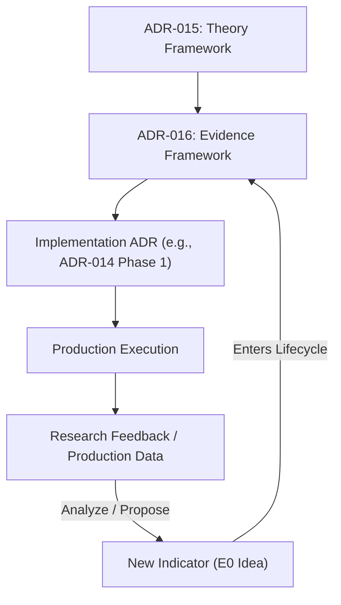

# ADR Knowledge Base Overview

> **The purpose of this knowledge base is not to maximize the number of indicators, but to maximize the quality of evidence supporting production decisions.**

This document serves as the high-level guide for AI Agents and developers entering the Multi-Timeframe Spread (MTS) codebase. It outlines the **MTS Strategy Engineering Methodology** defined by the theoretical foundation ([ADR-015](file:///Users/mylin/Documents/mylin102/tw-trading-unified/docs/adrs/ADR-015-statistical-arbitrage-framework.md)) and the validation governance ([ADR-016](file:///Users/mylin/Documents/mylin102/tw-trading-unified/docs/adrs/ADR-016-evidence-based-indicator-lifecycle.md)).

---

## 1. System Evolution Loop

The framework establishes a continuous feedback loop between theoretical modeling, evidence verification, live implementation, and research feedback:



---

## 2. Theoretical Foundation (ADR-015)

The MTS Calendar Spread is modeled as a **locally mean-reverting statistical process constrained by futures market microstructure**.

### A. Core Paradigm Shift
* **Statistical Arbitrage**: The strategy is a mean reversion system (resembling FX pair trading), not a trend-following system.
* **Local vs. Global Mean**: Spreads do not revert to a single global mean. The mean shifts across sessions, rollovers, and contract cycles. All statistical assumptions (mean, standard deviation, half-life) are estimated **locally** per regime and contract cycle.
* **Indicator Separation**:
  * **Trend Indicators** (e.g., MACD, EMA Cross, Momentum) answer: *Is trend persisting?*
  * **Volatility Regime Indicators** (e.g., Squeeze, ATR Percentile, Volatility Compression) answer: *Is volatility compressed?*
  * **Statistical Position Indicators** (e.g., BB Position, Z-score, Percentile) answer: *Is there extreme price/spread deviation?*
  * **Constraint**: Consequently, protective exits (Release gates) must not be vetoed by trend, volatility regime, or statistical position indicators.

### B. Three-Layer Architecture

```
Layer 1: Market Structure (Tick size, queue priority, volume, settlement, FND/LTD)
    ↓
Layer 2: Statistical Model (Local mean estimation, dispersion estimation, state detection, hypothesis testing)
    ↓
Layer 3: Execution (VWAP, ATR, Profit Lock, confirmation guards)
```

> [!NOTE]
> **Layer 2 describes capabilities, not specific algorithms.** Local mean estimation can be implemented via EMA, SMA, Kalman Filters, or Ornstein-Uhlenbeck (OU) processes. These algorithms are concrete implementation choices of subsequent ADRs, whereas the requirement for local mean estimation is an invariant of the framework.

---

## 3. Evidence-Based Governance (ADR-016)

> *Absence of evidence is not evidence of absence. However, absence of sufficient evidence is sufficient reason to exclude an indicator from the Decision Engine.*

Any indicator introduced to the system must progress through the standardized **Evidence Lifecycle** and satisfy strict promotion gates.

### A. Harmonized Evidence Lifecycle

| Stage | Name | Description |
|---|---|---|
| **E0** | **Idea** | Hypothesis formulated; documented for traceability. |
| **E1** | **Shadow** | Telemetry collected in production with zero decision influence. |
| **E2** | **Counterfactual** | Historical analysis: *"Would this have improved past decisions?"* |
| **E3** | **Offline Validation** | Backtest with realistic execution frictions (slippage, fees). |
| **E4** | **OOS Validation** | Walk-forward validation on unseen out-of-sample data. |
| **E5** | **Shadow Assist** | Runs live in production shadow, operator-visible on dashboard. |
| **E6** | **Production** | Active input in the Decision Engine. |
| **E6+** | **Operational Monitoring** | Continuous production performance tracking. |
| **E7** | **Retirement** | Decommissioned and archived in the **Negative Results Repository**. |

> [!TIP]
> **Operational Monitoring validates that production behavior continues to satisfy Architecture and Governance invariants.** 
> Stage E6+ does not just monitor financial PnL performance; it proactively tracks indicators for Decision Drift, State Invariants, Shadow Divergence, and compliance with ADR-009 through ADR-016. It validates whether the *design itself* still holds true. This stage acts as a hook for future Observability ADRs.

---

## 4. Design Invariants

All future work must respect the following invariants (ordered from risk down to process):

| Invariant | Target Question | Core Constraint |
|---|---|---|
| **Risk Invariant** | *What must never be broken?* | Protective exits (Release gates) cannot be vetoed by predictive indicators (Trend, Volatility, or Statistical Position). |
| **Theory Invariant** | *On which model should decisions be built?* | Decisions must satisfy the [ADR-015](file:///Users/mylin/Documents/mylin102/tw-trading-unified/docs/adrs/ADR-015-statistical-arbitrage-framework.md) Statistical Arbitrage paradigm. |
| **Evidence Invariant** | *What evidence is sufficient to change decisions?* | Every indicator must satisfy the [ADR-016](file:///Users/mylin/Documents/mylin102/tw-trading-unified/docs/adrs/ADR-016-evidence-based-indicator-lifecycle.md) lifecycle stage-gate requirements. |
| **Process Invariant** | *How do new capabilities enter the system?* | Research precedes production. Live execution code must never bypass the validation framework. |

---

## 5. Living Evidence & Research Success

A key symmetry of the MTS engineering methodology is the distinction between decisions and evidence:

> **Architecture decisions are intentionally stable. Evidence is intentionally re-evaluatable.**

### Guiding Principle
> **Evidence expires more readily than architecture.**

Market regimes shift and structural realities in Layer 1 (Market Structure) change over time. Consequently, research conclusions preserved in the **Negative Results Repository (E7)** are not permanently dead. If market conditions change, prior counterfactual or backtest results can be reopened and re-evaluated under the new regime. Evidence is fluid and adaptive; the core architectural invariants preserving risk management remain stable.

### Redefining Research Success
> **A completed research project is successful regardless of whether it results in adoption or rejection, provided it produces reproducible evidence.**

Defining success as "producing reproducible evidence" prevents the temptation of parameter-tuning/curve-fitting (p-hacking) simply to force an indicator through lifecycle gates. A documented rejection (retired to E7) is a formal asset that builds institutional knowledge and prevents future re-proposals of failed ideas.

---

## 6. Research Quality & Threat Analysis

Every research proposal or report (Stage E2 through E4) must explicitly analyze its **Threats to Validity** before advancing to the next stage:

* **Internal Validity**: Could execution latencies, data dropouts, bid-ask spreads, or tracking errors explain the simulated performance improvements?
* **External Validity**: Does the proposed relationship generalize across different market regimes, sessions (day vs. night), or contract periods?
* **Construct Validity**: Does the indicator measure the intended underlying factor (e.g., does Squeeze actually measure volatility regime or is it leaking trend bias)?
* **Statistical Validity**: Is the sample size large enough to avoid overfitting? Are confidence intervals reported? Did the methodology control for multiple comparison bias?

> *Example Threat:* In calendar spread research, failing to exclude the rollover window data shifts the spread distribution mechanically (due to volume migration), invalidating Layer 2 statistical mean-reversion assumptions.

---

## 7. Current Code Impact (Decoupled Release)

### Protective Exit Path
* **Decoupled**: The release/exit execution path no longer depends on **Squeeze** (volatility regime) or **Bollinger Bands Position** (statistical location).
* **Shadow Telemetry**: Both indicators remain fully active as **Shadow Telemetry (E1)** to gather empirical data for future counterfactual studies.

### Future Indicator Research
Any future statistical feature proposals—for example, **Half-life Estimation**, **Ornstein-Uhlenbeck (OU) processes**, or **Structural Break Detection**—start at **E0/E1** and must go through the E1 $\rightarrow$ E2 $\rightarrow$ E3 sequence before implementation.

---

## 8. Governance Invariant on Framework Stability

> **Framework documents should change only when the methodology itself changes, not when individual research results change.**

This rule guarantees that the theoretical foundation (ADR-015) and validation process (ADR-016) are frozen and decoupled from tactical adjustments of specific strategies. New models or statistical algorithms are proposed as implementation records, leaving the core governance unchanged.

---

## ADR Index Reference

The complete methodology, including framework ADRs, system map, and reading order, is documented in [docs/adrs/INDEX.md](file:///Users/mylin/Documents/mylin102/tw-trading-unified/docs/adrs/INDEX.md).

<!-- 2026-07-16 Gemini CLI: refined ADR Knowledge Base README.md for MTS Strategy Engineering Methodology v1.0 (final freeze) -->
