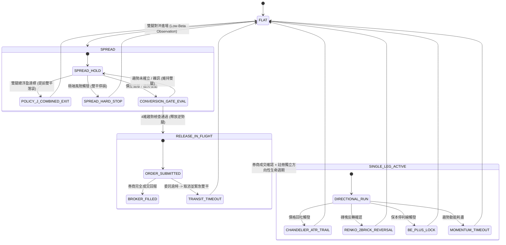

# MTS 2.0: 對沖起始的趨勢轉換策略 — Codebase 架構映射與落地規格書
## (Hedged-Entry Trend Conversion Strategy — Codebase Architecture Mapping)

---

## 1. 核心哲學重塑與 Codebase 現狀診斷

### 1.1 現有 Codebase 執行鏈 (Trace Path)
透過 `codebase-memory-mcp` 追蹤之調用關係：
```
TMFSpread.on_bar()
 └── TMFSpread._manage_position()  [strategies/plugins/futures/active/tmf_spread.py:3625]
      ├── 1. _evaluate_risk() (計算 release_stop, trail_dist)
      ├── 2. _update_policy_j_peak() (更新 Policy J Combined Peak)
      └── 3. MtsLifecycleAdapter.evaluate()  [strategies/plugins/futures/active/mts_lifecycle_adapter.py]
           └── evaluate_lifecycle_actions()
                ├── _check_manual_candidate()
                ├── _check_stoploss_candidate()
                ├── _check_timeout_candidate()
                ├── _check_combined_upl_trail_candidate() (Policy J)
                ├── _check_release_candidates()  <── 🚨 關鍵重構點
                └── _check_trail_candidate()     <── 🚨 關鍵重構點
```

### 1.2 現行缺陷診斷
1. **`_check_release_candidates()` 僅按 PnL 判定**：
   * 現狀：`near_hit = ctx.near_pnl_pts <= -threshold`，誰虧損就平誰。
   * 缺陷：因月份基差（Basis skew）、點差或暫時性滑價，帳面虧損腿不一定是市場的「真實逆勢腿」。
2. **缺乏多維度趨勢確認 (Trend Confirmation)**：
   * 系統現有強大的 [`RenkoTracker`](file:///Users/mylin/Documents/mylin102/tw-trading-unified-release15/strategies/plugins/futures/active/renko_tracker.py)、`mtf_score` 與 `VWAP`，但尚未深度接入 Release 仲裁。
3. **`SINGLE_LEG` 尚未具備獨立生命週期**：
   * 現狀：釋放一腿後，剩餘腿僅做簡單的 `rem_low <= peak - trail_dist` 移動停利，未享有獨立的保本鎖定 (BE Lock)、動態 ATR 縮緊與動能逾時保護。

---

## 2. 進化架構四階段設計 (4-Stage Lifecycle)



---

## 3. 五大模組重構與程式碼規格 (Code-Level Specs)

### 📌 模組 1: 四維趨勢確認閘門 (`TrendConfirmationGate`)
* **目標檔案**：[`strategies/futures/mts/normal_release_policy.py`](file:///Users/mylin/Documents/mylin102/tw-trading-unified-release15/strategies/futures/mts/normal_release_policy.py) 與 [`strategies/plugins/futures/active/mts_lifecycle_adapter.py`](file:///Users/mylin/Documents/mylin102/tw-trading-unified-release15/strategies/plugins/futures/active/mts_lifecycle_adapter.py)
* **規格定義**：
```python
from enum import Enum
from dataclasses import dataclass

class TrendRegime(Enum):
    STRONG_BULL = "STRONG_BULL"
    STRONG_BEAR = "STRONG_BEAR"
    CHOP = "CHOP"

@dataclass(frozen=True)
class TrendGateDecision:
    allowed: bool
    release_leg: Leg | None
    retain_leg: Leg | None
    rejection_reason: str = "NONE"

def evaluate_trend_conversion_gate(
    near_side: Side,          # 近月持倉方向 (LONG/SHORT)
    far_side: Side,           # 遠月持倉方向 (SHORT/LONG)
    renko_trend: str,         # RenkoTracker.trend ("UP"/"DOWN")
    renko_bricks: int,        # 連續同向磚數 (>= 2)
    mtf_score: float | None,  # Multi-timeframe Score
    near_pnl: float,
    far_pnl: float,
) -> TrendGateDecision:
    # 1. 趨勢強度檢驗：必須有至少 2 顆同向 Renko 磚塊確認
    if renko_bricks < 2 or renko_trend not in ("UP", "DOWN"):
        return TrendGateDecision(allowed=False, release_leg=None, retain_leg=None, rejection_reason="CHOP_OR_INSUFFICIENT_BRICKS")
    
    market_trend = TrendRegime.STRONG_BULL if renko_trend == "UP" else TrendRegime.STRONG_BEAR
    
    # 2. 趨勢與持倉映射仲裁 (Arbitration Matrix)
    if market_trend == TrendRegime.STRONG_BULL:
        # 強多趨勢：必須釋放空頭腿 (SHORT)，保留多頭腿 (LONG)
        if near_side == Side.SHORT and far_side == Side.LONG:
            return TrendGateDecision(allowed=True, release_leg=Leg.NEAR, retain_leg=Leg.FAR)
        elif near_side == Side.LONG and far_side == Side.SHORT:
            return TrendGateDecision(allowed=True, release_leg=Leg.FAR, retain_leg=Leg.NEAR)
    elif market_trend == TrendRegime.STRONG_BEAR:
        # 強空趨勢：必須釋放多頭腿 (LONG)，保留空頭腿 (SHORT)
        if near_side == Side.LONG and far_side == Side.SHORT:
            return TrendGateDecision(allowed=True, release_leg=Leg.NEAR, retain_leg=Leg.FAR)
        elif near_side == Side.SHORT and far_side == Side.LONG:
            return TrendGateDecision(allowed=True, release_leg=Leg.FAR, retain_leg=Leg.NEAR)

    return TrendGateDecision(allowed=False, release_leg=None, retain_leg=None, rejection_reason="LEG_ALIGNMENT_MISMATCH")
```

---

### 📌 模組 2: 券商權威確認與過渡期風控不變量
* **目標檔案**：[`strategies/plugins/futures/active/mts_lifecycle_adapter.py`](file:///Users/mylin/Documents/mylin102/tw-trading-unified-release15/strategies/plugins/futures/active/mts_lifecycle_adapter.py)
* **核心原則**：
  1. `ReleaseGroupStatus` 處於 `SUBMITTING`, `SUBMITTED`, `PARTIALLY_FILLED` 期間，`lifecycle.phase` 嚴格維持 `SPREAD`。
  2. 收到券商 `FILLED` 事件後，原子化切換至 `PositionPhase.SINGLE_LEG`，同時記錄 `released_realized_loss_twd` 與 `single_leg_start_time`。

---

### 📌 模組 3: `SINGLE_LEG` 獨立出場引擎 (`SingleLegTrailingEngine`)
* **目標檔案**：[`core/order_management/exit_arbiter.py`](file:///Users/mylin/Documents/mylin102/tw-trading-unified-release15/core/order_management/exit_arbiter.py) 與 [`strategies/plugins/futures/active/mts_lifecycle_adapter.py`](file:///Users/mylin/Documents/mylin102/tw-trading-unified-release15/strategies/plugins/futures/active/mts_lifecycle_adapter.py)
* **規格定義**：
  1. **動態 ATR 縮緊**：
     * 初始寬度：$2.5 \times \text{ATR}$（允許趨勢呼吸）。
     * 獲利達到 $30\text{ 點}$ 後：收緊為 $1.8 \times \text{ATR}$。
     * 獲利達到 $60\text{ 點}$ 後：收緊為 $1.2 \times \text{ATR}$（鎖定利潤）。
  2. **Renko 2-Brick Reversal Exit**：
     * 呼叫 [`RenkoTracker`](file:///Users/mylin/Documents/mylin102/tw-trading-unified-release15/strategies/plugins/futures/active/renko_tracker.py)，若出現反向 2 顆磚塊（如多頭持倉時連續出現 2 顆紅磚/向下磚），立刻生成 `TRAIL_RENKO_REVERSAL` 訊號。
  3. **Break-Even Plus Lock**：
     * 當 $\text{Floating UPL} \ge |\text{Released Leg Realized Loss}| + 92\text{ TWD}$ 時，停損線錨定至保本價位之上。

---

### 📌 模組 4: 雙向退出仲裁 (Policy J 競態優先)
* **目標檔案**：`_check_combined_upl_trail_candidate()`
* **原則**：在 `SPREAD` 階段，若雙腿加總淨利已達標（$\ge 300\text{ TWD}$），直接執行 `COMBINED_EXIT` 雙腿全平，優先於任何 Release 單腿動作。

---

### 📌 模組 5: 反事實遙測與效能評估 (Counterfactual Telemetry)
* **目標檔案**：[`core/counterfactual_service.py`](file:///Users/mylin/Documents/mylin102/tw-trading-unified-release15/core/counterfactual_service.py) 與 [`strategies/futures/mts/policy_j_telemetry_writer.py`](file:///Users/mylin/Documents/mylin102/tw-trading-unified-release15/strategies/futures/mts/policy_j_telemetry_writer.py)
* **遙測欄位**：
  * `actual_single_leg_pnl`: 實盤單腿出場淨損益
  * `counterfactual_spread_hold_pnl`: 假設雙腿抱到收盤之淨損益
  * `conversion_alpha_gain = actual_single_leg_pnl - counterfactual_spread_hold_pnl`
  * `trend_confirmation_accuracy`: 趨勢確認準確率（Release 後順勢腿是否持續創波段高/低點）

---

## 4. 模組改動範圍與檔案清單

| 模組 | 涉及檔案 | 主要改動點 |
| :--- | :--- | :--- |
| **Contracts** | [`strategies/futures/mts/contracts.py`](file:///Users/mylin/Documents/mylin102/tw-trading-unified-release15/strategies/futures/mts/contracts.py) | 增加 `TrendGateDecision`, `TrendRegime` 定義 |
| **Policy** | [`strategies/futures/mts/normal_release_policy.py`](file:///Users/mylin/Documents/mylin102/tw-trading-unified-release15/strategies/futures/mts/normal_release_policy.py) | 實作四維趨勢確認與持倉方向映射仲裁 |
| **Lifecycle** | [`strategies/plugins/futures/active/mts_lifecycle_adapter.py`](file:///Users/mylin/Documents/mylin102/tw-trading-unified-release15/strategies/plugins/futures/active/mts_lifecycle_adapter.py) | 串接 `RenkoTracker`，重構 `_check_release_candidates` 與 `_check_trail_candidate` |
| **Integration** | [`strategies/plugins/futures/active/tmf_spread.py`](file:///Users/mylin/Documents/mylin102/tw-trading-unified-release15/strategies/plugins/futures/active/tmf_spread.py) | 注入 Renko / MTF 信號至 Lifecycle 上下文 |
| **Telemetry** | [`core/counterfactual_service.py`](file:///Users/mylin/Documents/mylin102/tw-trading-unified-release15/core/counterfactual_service.py) | 記錄 $\Delta\text{Alpha}_{\text{Conversion}}$ 反事實對比指標 |
| **Unit Tests** | `tests/strategies/test_mts_trend_conversion.py` | 撰寫 4-Way 仲裁、Renko Reversal 與 Broker Authority 單元測試 |
