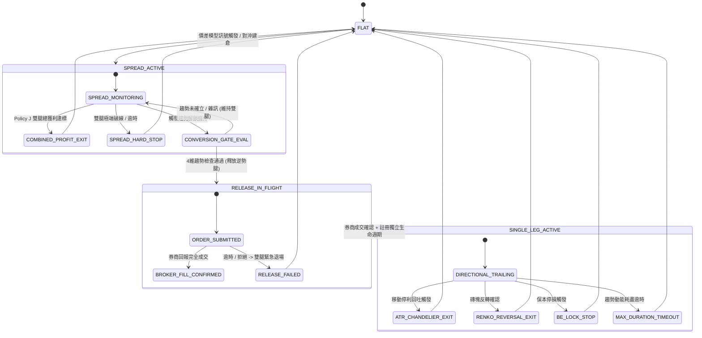

# MTS 2.0: 對沖起始的趨勢轉換策略架構規格書
## (Hedged-Entry Trend Conversion Strategy — Architecture & Evolution Roadmap)

---

## 1. 核心哲學重塑 (Paradigm Shift)

### 1.1 傳統視角 vs. 新視角

```
[ 傳統視角 (Legacy Spread Mindset) ]
價差均值回歸失敗 ──> 一腿觸及停損 ──> 被動平掉虧損腿 ──> 剩下一腿碰運氣 Trailing

[ 新視角 (Hedged-Entry Trend Conversion) ]
對沖進場 (低 Beta 觀察) ──> 宏觀/微觀趨勢確認 ──> 主動釋放逆勢腿 ──> 獨立方向性部位高效獲利
```

* **核心定位**：
  > **Hedged entry → Trend confirmation → Counter-trend leg release → Directional trailing**
* **策略本質**：
  跨期多空雙腿不是為了單純賺取價差回歸的微薄利潤，而是作為**「低方向曝險的進場載體（Low-Beta Market Entry Vehicle）」**，在市場方向不明朗時吸收噪音、保留選擇權；一旦趨勢明確成型，主動平掉逆勢腿，轉化為具備獨立生命週期的方向性波段交易。

---

## 2. 兩大階段與四大子生命週期 (4-Stage Lifecycle)



---

## 3. 五大進化支柱 (Five Architectural Pillars)

### 🏛️ Pillar I: 四維趨勢確認閘門 (4-Way Trend Confirmation Gate)

> **絕對禁止**僅以「腿別帳面盈虧」來決定釋放哪條腿！必須根據「市場客觀趨勢」與「持倉方向」的映射關係進行仲裁。

```python
# 設計模型：ReleaseDecisionEngine
@dataclass(frozen=True)
class TrendGateContext:
    market_trend: TrendDirection      # BULLISH / BEARISH / CHOP
    trend_confidence: float          # 0.0 ~ 1.0 (基於 ADL SNR, Renko 2磚同向, VWAP 偏離)
    near_position_side: Side         # LONG / SHORT
    far_position_side: Side          # SHORT / LONG
    retained_momentum_pts: float     # 留存腿自身的動能強度
    basis_spread_z: float            # 價差偏離程度
```

#### 仲裁邏輯矩陣 (Arbitration Matrix)：

| 市場確認趨勢 | 近月腿持倉 | 遠月腿持倉 | 判定應釋放腿 (Release) | 判定留存腿 (Retain) | 執行條件 |
| :--- | :--- | :--- | :--- | :--- | :--- |
| **BULLISH** (強多) | `SHORT` | `LONG` | **Near (近月空)** | **Far (遠月多)** | Confidence > 0.7 且 Far 動能支持 |
| **BULLISH** (強多) | `LONG` | `SHORT` | **Far (遠月空)** | **Near (近月多)** | Confidence > 0.7 且 Near 動能支持 |
| **BEARISH** (強空) | `LONG` | `SHORT` | **Near (近月多)** | **Far (遠月空)** | Confidence > 0.7 且 Far 動能支持 |
| **BEARISH** (強空) | `SHORT` | `LONG` | **Far (遠月多)** | **Near (近月空)** | Confidence > 0.7 且 Near 動能支持 |
| **CHOP** (盤整/不明) | 任意 | 任意 | **BLOCK (禁止釋放)** | **維持雙腿對沖** | 不執行 Release |

---

### 🏛️ Pillar II: 嚴格狀態機與券商權威確認 (Broker Authority & Atomic Transit)

1. **拒絕提前單腿假設 (No Premature Single-Leg State)**：
   * 在送出 Release 委託單期間（`SUBMITTING` / `SUBMITTED` / `PARTIALLY_FILLED`），系統**必須嚴格視為雙腿部位**，繼續受雙腿最大虧損保護。
2. **券商成交回報是唯一的狀態躍遷權威 (Broker Authority Gate)**：
   * 只有在收到券商的 `FILLED` 事件並確認口數平倉完成後，才將部位標記為 `SINGLE_LEG_ACTIVE`。
3. **異常熔斷機制 (Fail-Safe Handling)**：
   * 若 Release 委託超過 $N$ 秒未成交或遭券商 Reject，立刻 Cancel 並評估是否觸發 `EMERGENCY_FLAT_BOTH`（雙腿同時市價全平），絕不留下一半不明狀態的部位。

---

### 🏛️ Pillar III: `SINGLE_LEG` 獨立生命週期與動態風控

留存下來的順勢腿是一筆**全新的獨立方向性交易**，具備專屬的退出規則：

1. **階梯式 ATR Chandelier Trailing**：
   * 當順勢腿創新高/新低時，動態計算頂點 `PeakPrice`。
   * Trailing Stop 設定為 $\text{StopPrice} = \text{PeakPrice} \mp (k \times \text{ATR}_{1m})$。
   * 獲利擴大時，$k$ 可從 $2.5$ 動態收緊至 $1.5$，鎖定利潤。
2. **Renko 磚塊反轉退出 (Renko Reversal Exit)**：
   * 若 Renko 磚塊出現連續 2 顆反向磚，視為趨勢力竭，即刻出場。
3. **保本鎖定線 (Break-Even Plus Lock)**：
   * 當順勢腿浮盈足以完全覆蓋「已釋放腿的實現虧損」+「所有手續費與滑價（如 92 TWD）」時，停損點自動移至保本線上方。
4. **動能衰退逾時保護 (Max Duration Exit)**：
   * 單腿狀態持倉不得超過設定上限（例如 30 分鐘）；若趨勢陷入停滯，主動了結。

---

### 🏛️ Pillar IV: 雙向退出仲裁與 Policy J 協同

* **Policy J (雙腿總淨利 Trailing) 優先權**：
  * 在 `SPREAD` 階段，若市場未發生強烈單邊趨勢，但價差本身的波動已經帶來足夠的總結算獲利（$\ge \text{ActivationThreshold}$），則觸發 `COMBINED_EXIT` 雙腿同時獲利了結。
  * **原則**：價差利潤已落袋時，無需強行轉單腿冒方向性風險。

---

### 🏛️ Pillar V: 反事實遙測與量化評估 (Counterfactual Telemetry)

為每一筆交易記錄反事實對照指標（Counterfactual Diagnostics）：

$$\Delta \text{Alpha}_{\text{Conversion}} = \text{PnL}_{\text{Actual (Single-Leg)}} - \text{PnL}_{\text{Counterfactual (Hold-Spread)}}$$

1. **轉換勝率 (Conversion Success Rate)**：Release 後順勢腿獲利 > 0 的比例。
2. **轉換阿爾法增益 (Alpha Gain)**：相較於「一路抱雙腿到收盤」多賺取的點數。
3. **錯誤釋放率 (False Release Rate)**：Release 後被反噬停損的次數與原因歸因分析。

---

## 4. 階段實施里程碑 (Milestone Roadmap)

```
[ Phase 1: 概念模型與 Contracts 重構 ] (contracts.py / state.py)
   ├── 定義 TrendDirection, TrendGateContext, ConversionEvaluation
   └── 將 NormalReleasePolicy 擴展為 HedgedTrendConversionPolicy

[ Phase 2: 趨勢確認閘門與信號連接 ] (trend_engine.py / renko_shadow.py)
   ├── 整合 ADL SNR / 1m-5m Renko / Micro VWAP 指標
   └── 實作 4-Way 仲裁矩陣 (禁止純按 PnL 釋放)

[ Phase 3: 券商權威確認與轉移原子性 ] (mts_lifecycle_adapter.py)
   ├── 嚴格維持 In-Flight Spread 風控
   └── 券商 Fill 回報後原子化註冊 Single-Leg 獨立狀態

[ Phase 4: SINGLE_LEG 獨立 Trailing 與退出引擎 ]
   ├── 實作 ATR Chandelier + Renko 雙軌動態出場
   └── 實作 Break-Even Lock 與 Time Decay

[ Phase 5: Replay 回測、反事實驗證與上線評估 ]
   ├── 利用 2026 年歷史 Tick 進行 Replay 比較
   └── 輸出 Alpha Gain 遙測報表
```
