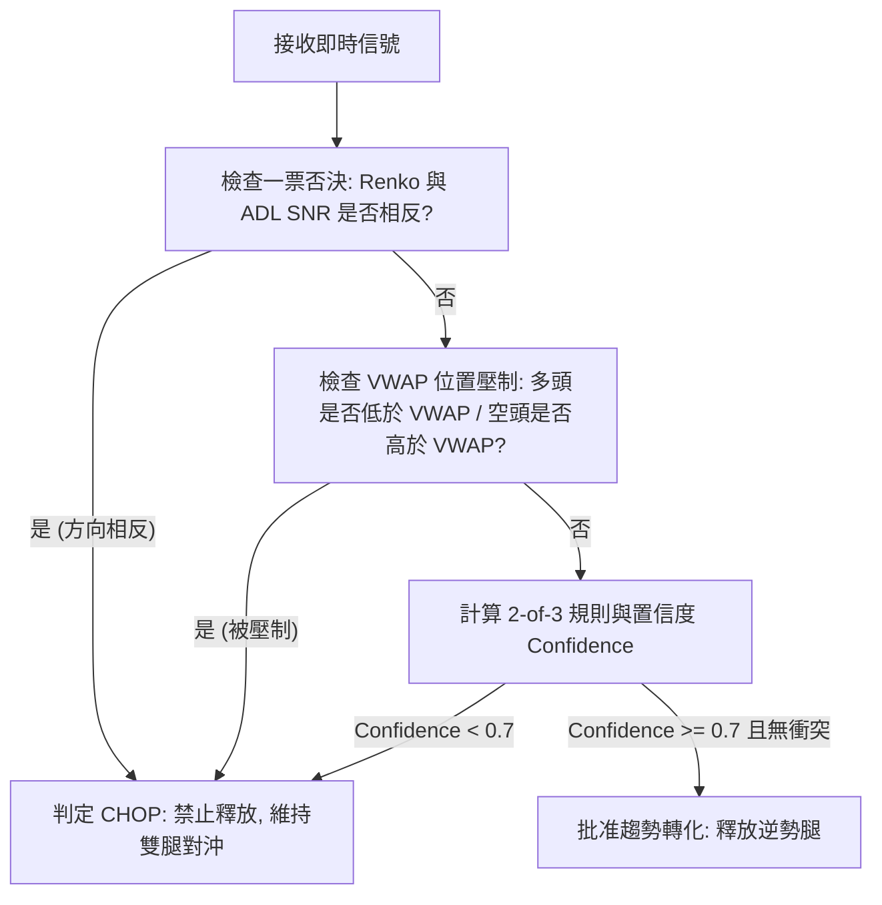

# MTS 2.0: 趨勢確認訊號與衝突仲裁正式規格書
## (Formal Specification for ADL SNR, Renko, Micro-VWAP & Conflict Resolution)

---

## 1. ADL SNR (累積派發線信噪比 / Signal-to-Noise Ratio)

### 1.1 數學定義與公式
ADL SNR 衡量市場動能相對於隨機震盪噪音的純度（Efficiency & Trend Strength）。

1. **累積派發線 (ADL)**：
   $$\text{MFM}_t = \frac{(C_t - L_t) - (H_t - C_t)}{H_t - L_t} \quad (\text{若 } H_t = L_t \text{ 則 } \text{MFM}_t = 0)$$
   $$\text{MFV}_t = \text{MFM}_t \times V_t$$
   $$\text{ADL}_t = \text{ADL}_{t-1} + \text{MFV}_t$$
2. **線性迴歸斜率與殘差標準差**：
   在滾動窗口 $N$ 根 Bar 內，對 $\text{ADL}$ 進行最小平方法 (OLS) 線性迴歸：
   $$\text{ADL}_i = \alpha + \beta \cdot i + \epsilon_i \quad (i = 1, \dots, N)$$
   $$\text{Residual Std} = \sigma_\epsilon = \sqrt{\frac{1}{N-2} \sum_{i=1}^N \epsilon_i^2}$$
3. **SNR 標量化指標**：
   $$\text{ADL\_SNR}_t = \frac{\beta \times N}{\sigma_\epsilon + \delta} \quad (\delta = 10^{-6} \text{ 防止除零})$$

### 1.2 參數與資料來源
* **計算週期 (Window $N$)**：$N = 12$ 根 5 分鐘 Bar（即 60 分鐘滾動窗口）。
* **資料來源 (Data Source)**：台指期近月合約 (`TMFR1` / Front-Month) 之 5m OHLCV，即時以最新 Tick 更新當前 Bar。
* **方向門檻 (Direction Threshold)**：
  * **$\text{ADL\_SNR} > +1.8$** 且 $\beta > 0$ $\to$ `BULLISH` (多頭動能充沛)
  * **$\text{ADL\_SNR} < -1.8$** 且 $\beta < 0$ $\to$ `BEARISH` (空頭動能充沛)
  * **$|\text{ADL\_SNR}| \le 1.8$** $\to$ `CHOP` (盤整/無效動能)

---

## 2. Renko Tracker (事件驅動價格磚塊)

### 2.1 價格來源與治理約束
* **價格來源 (Price Source)**：
  * 遵循 [`RenkoGovernanceMandate`](file:///Users/mylin/Documents/mylin102/tw-trading-unified-release15/strategies/plugins/futures/active/renko_tracker.py)：
    * 多頭方向使用 `EXECUTABLE_BID`，空頭方向使用 `EXECUTABLE_ASK`，或近月真實成交 Tick 價。
    * **磚塊收盤價僅為觀測標籤，不得作為成交價**。
* **磚值 (Locked Brick Size)**：
  * 於進場時鎖定，整個持倉生命週期保持不變（避免盤中磚值跳動導致狀態紊亂）：
    $$\text{Brick Size} = \max\left(10.0, \text{round}\left(0.5 \times \text{ATR}_{1m} \times 4.0\right) / 4.0\right)$$
    （以 0.25 點為最小跳動刻度，TMF 預設底線為 10 點）。

### 2.2 成磚機制與盤中可用性
* **成磚時間 (Completion Timing)**：
  * **逐 Tick 事件驅動 (Event-driven)**：每次接收到新鮮 Tick 價格 $P_{\text{tick}}$：
    * 若 $P_{\text{tick}} \ge \text{RenkoClose} + \text{BrickSize}$ $\to$ 生成向上磚 (`UP`, $+1$)，更新 $\text{RenkoClose} \leftarrow \text{RenkoClose} + \text{BrickSize}$。
    * 若 $P_{\text{tick}} \le \text{RenkoClose} - \text{BrickSize}$ $\to$ 生成向下磚 (`DOWN`, $-1$)，更新 $\text{RenkoClose} \leftarrow \text{RenkoClose} - \text{BrickSize}$。
* **盤中可用性 (Intra-day Availability)**：
  * 盤中**完全即時可用**。
  * **趨勢成立條件**：同向累積成磚數 $\ge 2$ 顆（`consecutive_bricks >= 2`）。
  * **反轉確認條件**：在持有部位反方向出現連續 $\ge 2$ 顆反向磚。

---

## 3. Micro VWAP (微觀成交量加權平均價)

### 3.1 窗口與計算公式
* **計算公式**：
  $$\text{VWAP}_t = \frac{\sum_{i=1}^k P_i \times V_i}{\sum_{i=1}^k V_i}$$
  $$\text{VWAP\_Std}_t = \sqrt{\frac{\sum_{i=1}^k V_i \times (P_i - \text{VWAP}_t)^2}{\sum_{i=1}^k V_i}}$$
* **雙軌窗口 (Dual-Window)**：
  1. **滾動微觀窗口 (Rolling 15m)**：過去 15 分鐘（180 筆 5-sec 採樣點）之局部 VWAP，捕捉超短期量價中心。
  2. **Session 累積窗口 (Session VWAP)**：當前交易時段之錨定 VWAP。

### 3.2 日夜盤重置與結算日規則
* **日盤重置點**：每日 `08:45:00` 撮合開盤第一筆，清空所有累計量價，重新計算。
* **夜盤重置點**：每日 `15:00:00` 夜盤開盤第一筆，清空所有累計量價，重新計算。
* **結算日 (Settlement Day)**：每月第三個週三 `13:30:00` 結算後，近月合約切換，於 `15:00:00` 夜盤對新近月合約重新錨定。

### 3.3 偏離閾值 (Deviation Threshold)
* **多頭偏離門檻**：$P_{\text{tick}} - \text{VWAP} \ge +0.3 \times \text{ATR}_{1m}$（且偏離持續 $\ge 30\text{ 秒}$） $\to$ `ABOVE`
* **空頭偏離門檻**：$P_{\text{tick}} - \text{VWAP} \le -0.3 \times \text{ATR}_{1m}$（且偏離持續 $\ge 30\text{ 秒}$） $\to$ `BELOW`
* **中性/貼近門檻**：$|P_{\text{tick}} - \text{VWAP}| < 0.3 \times \text{ATR}_{1m}$ $\to$ `NEUTRAL`

---

## 4. 三訊號衝突處理與優先仲裁規則 (Conflict Resolution Matrix)



### 4.1 決策矩陣 (Arbitration Matrix)

| 場景編號 | Renko (價格磚) | ADL SNR (量價動能) | Micro VWAP (微觀位置) | 仲裁狀態 (Regime) | 最終裁決 | 執行細節 |
| :---: | :---: | :---: | :---: | :---: | :---: | :--- |
| **C1** | `UP` ($\ge 2$ 磚) | `BULLISH` ($> 1.8$) | `ABOVE` ($> +0.3\text{ATR}$) | **STRONG_BULL** | **PASS** | 釋放空頭腿；順勢多頭以標準 $2.5\times\text{ATR}$ Trailing |
| **C2** | `DOWN` ($\ge 2$ 磚) | `BEARISH` ($< -1.8$) | `BELOW` ($< -0.3\text{ATR}$) | **STRONG_BEAR** | **PASS** | 釋放多頭腿；順勢空頭以標準 $2.5\times\text{ATR}$ Trailing |
| **C3** | `UP` ($\ge 2$ 磚) | `BULLISH` ($> 1.8$) | `NEUTRAL` (在 VWAP 附近) | **MODERATE_BULL** | **PASS** | 釋放空頭腿；順勢多頭 Trailing 初始收緊為 $1.8\times\text{ATR}$ |
| **C4** | `UP` ($\ge 2$ 磚) | `CHOP` ($|\text{SNR}| \le 1.8$) | `ABOVE` ($> +0.3\text{ATR}$) | **MODERATE_BULL** | **PASS** | 釋放空頭腿；順勢多頭 Trailing 初始收緊為 $1.8\times\text{ATR}$ |
| **C5** | `DOWN` ($\ge 2$ 磚) | `BEARISH` ($< -1.8$) | `NEUTRAL` (在 VWAP 附近) | **MODERATE_BEAR** | **PASS** | 釋放多頭腿；順勢空頭 Trailing 初始收緊為 $1.8\times\text{ATR}$ |
| **C6** | `DOWN` ($\ge 2$ 磚) | `CHOP` ($|\text{SNR}| \le 1.8$) | `BELOW` ($< -0.3\text{ATR}$) | **MODERATE_BEAR** | **PASS** | 釋放多頭腿；順勢空頭 Trailing 初始收緊為 $1.8\times\text{ATR}$ |
| **E1** | `UP` (向上成磚) | `BEARISH` (量能背離) | 任意 | **DIVERGENCE** | **BLOCK** | **一票否決**（誘多假突破，嚴禁釋放） |
| **E2** | `DOWN` (向下成磚) | `BULLISH` (量能背離) | 任意 | **DIVERGENCE** | **BLOCK** | **一票否決**（誘空假跌破，嚴禁釋放） |
| **E3** | `UP` (向上成磚) | 任意 | `BELOW` (在 VWAP 之下) | **SUPPRESSED** | **BLOCK** | **位置壓制**（價格處於均價逆側，嚴禁釋放） |
| **E4** | `DOWN` (向下成磚) | 任意 | `ABOVE` (在 VWAP 之上) | **SUPPRESSED** | **BLOCK** | **位置壓制**（價格處於均價逆側，嚴禁釋放） |
| **E5** | $< 2$ 磚 | 任意 | 任意 | **INSUFFICIENT** | **BLOCK** | 磚數未達標，維持雙腿對沖 |

### 4.2 置信度公式 (Confidence Score Formulation)
$$\text{Confidence} = 0.45 \times S_{\text{Renko}} + 0.35 \times S_{\text{ADL}} + 0.20 \times S_{\text{VWAP}}$$
* $S_{\text{Renko}} = 1.0$ 若同向磚 $\ge 2$；$0.0$ 若 $< 2$；$-1.0$ 若反向磚 $\ge 1$。
* $S_{\text{ADL}} = 1.0$ 若 $|\text{SNR}| > 1.8$ 且同向；$0.5$ 若 $|\text{SNR}| \le 1.8$（CHOP）；$-1.0$ 若反向。
* $S_{\text{VWAP}} = 1.0$ 若偏離同向；$0.5$ 若 `NEUTRAL`；$-1.0$ 若偏離反向。

* **門檻約束**：只有在 $\text{Confidence} \ge 0.70$ 且 **無任何子指標為負值 ($-1.0$)** 的情況下，才允許發出 `RELEASE` 決策！

---

## 5. 規範性澄清與安全限制（v1.1）

本節優先於本文件中較寬鬆或未明確的描述；未滿足任一條件時，決策必須為
`BLOCK`，不得進入 live release。

### 5.1 統一決策邊界與無前視資料

1. 所有訊號必須在同一個 `decision_ts` 建立 immutable snapshot。
2. `decision_ts` 只能使用 `decision_ts` 以前已完成的資料：ADL 使用已完成
   的 5m bar；Micro-VWAP 使用最後一個已完成窗口；Renko 使用已完成的磚。
3. 60m regime 與 15m exit signal 只能使用已完成 bar，訊號成立後於下一個
   可用 quote 執行，不得使用當根 bar close 作為成交價。
4. 每次決策必須記錄 `decision_ts`、各訊號 `asof_ts`、`execution_ts`、
   `decision_max_quote_age_ms` 及 `window_max_quote_age_ms`。
5. 必要 quote 超過 `DEGRADED`、refresh channel 非 `HEALTHY`、callback
   generation 不一致或 session 未授權時，決策為 `BLOCK`。

### 5.2 Renko 價格與狀態治理

1. 趨勢訊號固定使用同一種非方向偏置價格（優先 `MID`，無 mid 時使用 last
   trade）；不得因預測方向而選擇 bid 或 ask。
2. `EXECUTABLE_BID`/`EXECUTABLE_ASK` 只可用於成交與滑價模擬，不可用於
   產生方向訊號。
3. 磚值於 entry snapshot 鎖定，並記錄 seed price、brick size、最後完成磚
   timestamp 及連續同向磚數。單一 tick 跨越多磚時，須保守處理，不得製造
   額外的時間確認。
4. 方向切換時重置同向計數；未完成兩顆同向磚前一律 `INSUFFICIENT`。

### 5.3 ADL 與 VWAP 可重現性

1. ADL 必須有 12 根完整 5m bar warm-up；volume 為零、資料缺口或 residual
   variance 不可計算時回傳 `BLOCK`。
2. ADL 的日夜盤累積邊界、session calendar 與 volume 單位必須寫入 dataset
   manifest；不得以猜測的 calendar day 代替交易 session。
3. Micro-VWAP 的 5 秒採樣必須由原始 tick 重採樣；無 tick 的窗口不得前值
   填充為 fresh quote，volume 權重必須來自可驗證的成交量資料。
4. 結算日與合約切換必須使用交易所 calendar/contract metadata；「每月第三個
   週三」僅可作為測試 fallback，不得作為 production 判定。

### 5.4 正式仲裁規則

1. 採 `2-of-3`，至少兩個訊號必須同向；任何子訊號為反向（`-1.0`）即
   `DIVERGENCE/BLOCK`。
2. 保留權重：Renko 0.45、ADL 0.35、VWAP 0.20；`Confidence >= 0.70`
   且無負值才可 `PASS`。
3. `NEUTRAL` 可參與計分但不可單獨支持 release。方向衝突、資料不同步、
   warm-up 不足或 freshness 不足均覆蓋 confidence，直接 `BLOCK`。
4. 每個 trade_id 只可產生一次 trend release intent；pending、unknown、
   ambiguous 或已處理 intent 必須冪等阻擋重送。

### 5.5 風控與執行失敗處理

優先序固定為：

```text
Policy J COMBINED_EXIT
  > emergency single-leg hard stop
  > trend RELEASE
  > remaining-leg TRAIL
```

- Policy J 與 trend release 同一週期成立時，只執行 `COMBINED_EXIT`，不得先
  release 再 combined exit。
- 趨勢確認不是 emergency stop 的替代品；單腿 hard stop 必須獨立存在。
- release order partial fill、reject、timeout 或 refresh uncertainty 時，
  保留未平腿的 quarantine/lifecycle 狀態，不得猜測已完成，也不得自動重送。
- release 前必須核對 broker snapshot、active orders、positions 與本地 leg lock；
  不一致時以券商為準並 `BLOCK`。

### 5.6 反事實 replay 合約

三組 replay 必須共用相同 entry、資料 snapshot 與成本模型：

1. `BASELINE_SINGLE_LEG_RELEASE`：現行單腿 release + hard stop + trail。
2. `TREND_CONFIRMED_RELEASE`：本規格的 60m regime、15m completed-bar
   confirmation，於下一可用 quote 執行。
3. `NO_REVERSAL_COMBINED_EXIT`：沒有有效趨勢反轉時維持雙腿，直到 Policy J、
   hard stop 或明確時間上限觸發 combined exit。

Replay 必須模擬 bid/ask、手續費、保守滑價、延遲、partial fill、拒單及 stale
quote；缺資料不得插值。每組結果必須報告 eligible/skipped cases、coverage、
realized PNL、最大回撤、release 次數、combined exit 次數及 execution failures。
少於 30 個 eligible trades 只能標記 `RESEARCH_INSUFFICIENT_SAMPLE`，不得用來
放行 live。

### 5.7 驗收門檻

在任何程式實作前，必須通過：

- 訊號方向衝突、neutral、warm-up、stale quote 的單元測試；
- 同一 decision snapshot 不使用未完成 bar 的 property test；
- Policy J 優先於 release 的 arbitration test；
- duplicate/pending/partial-fill 不重送的 lifecycle test；
- 三組 replay 的相同輸入、成本、coverage 與結果 manifest 校驗；
- 連續交易日的 out-of-sample replay 與至少 30 個 eligible trades。

在上述驗收完成前，文件狀態為 `RESEARCH_ONLY`，不得啟用 live promotion。
