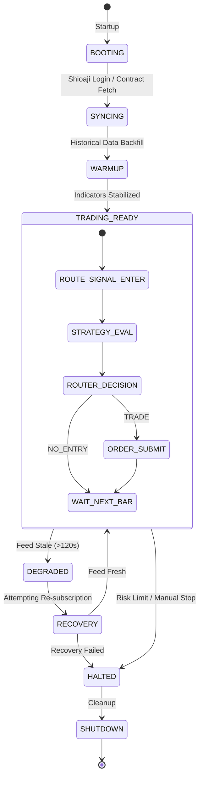

# Runtime State Machine Visualization

This document defines the lifecycle of the trading system. 

## State Definitions

1. **BOOTING**: Loading configuration, initializing singletons.
2. **SYNCING**: Authenticating with broker and resolving contract metadata.
3. **WARMUP**: Backfilling OHLCV data and calculating initial indicators.
4. **TRADING_READY**: All systems green, evaluating strategies on every bar.
5. **DEGRADED**: Ingestion delay detected. Trading paused for safety.
6. **RECOVERY**: Automated attempts to restore data stream.
7. **HALTED**: System stopped due to critical error or user command.
8. **SHUTDOWN**: Clearing memory, logging final PnL, closing connections.
